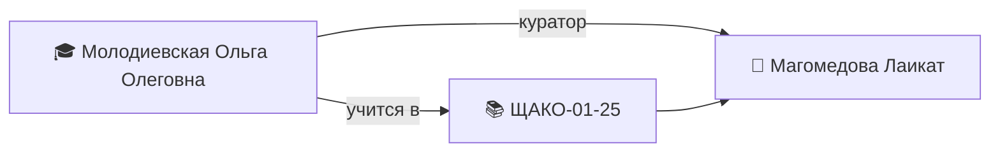

---
tags:
  - кпк/студент
  - "ЩАКО-01-25"
группа: "[[ЩАКО-01-25]]"
куратор: "[[Магомедова Лаикат]]"
классный_руководитель: 
дата_рождения:
пол:
телефон:
email:
снилс:
паспорт:
---

# 🎓 Молодиевская Ольга Олеговна

> [!warning] 🔒 Приватные данные
> СНИЛС, паспорт и контакты родителей — персональные данные. Заполняйте только то, что нужно для работы; не выносите в граф связей.

## 📋 Основное

> [!info]
> - **Группа:** [[ЩАКО-01-25]]
> - **Куратор:** [[Магомедова Лаикат]]
> - **Классный руководитель:** —
> - **Дата рождения:** —

## 👥 Контакты

> [!person] Контакты
> - 📱 **Личный:** —
> - 📧 **Email:** —
> - 💬 **Соцсети:** —
> - 🔒 **Контакты родителей:** —

## 👨👩👦 Семья

> [!family]
> - Мама: —
> - Папа: —
> - Состав: —
> - Особые отметки: —

## 🏥 Здоровье

> [!health] Здоровье
> - **Замечания:** —

## 📄 Документы

> [!doc] Документы
> - **СНИЛС:** — *(приватно)*
> - **Паспорт:** — *(приватно)*
> - **Копии документов:** —

## 🏅 Достижения и участие

| Дата | Мероприятие | Результат |
|------|-------------|-----------|
|  |  |  |

## 📊 Успеваемость

| Дата | Дисциплина | Оценка / отметка |
|------|------------|------------------|
|  |  |  |

## 📝 Журнал куратора

- —

## 🔗 Связи

---
