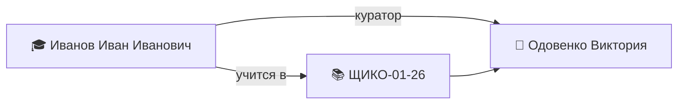

---
tags:
  - кпк/пример
группа:
куратор:
классный_руководитель:
дата_рождения: 1111-11-11
пол: М
телефон: +7 (123) 456-78-91
email: ivanov.ii@mail.ru
снилс: 123-456-789-123
паспорт: 1234 123456
---

# 🎓 Иванов Иван Иванович

> [!example] Это образец
> Файл-пример, показывающий, как заполнять заметку о студенте. Персонаж вымышленный. Копируйте структуру в реальные заметки.

> [!danger] 🔒 Приватные данные
> Поля «СНИЛС», «паспорт», «контакты родителей» — персональные данные.
> Правила: заполняйте только то, что реально нужно куратору; не выносите их в граф связей и общие дашборды; телефоны показывающему на экране лучше сворачивать.

## 📋 Основное

> [!info]
> - **Группа:** 
> - **Куратор:** 
> - **Классный руководитель:** —
> - **Дата рождения:** 14.05.2008

## 👥 Контакты

> [!person] Контакты
> - 📱 **Личный:** +7 (900) 000-00-00
> - 📧 **Email:** ivanov.ii@mail.ru
> - 💬 **Соцсети:** [ссылка, если известна]
> - 🔒 **Контакты родителей:** мама — Иванова Мария Ивановна, +7 (900) 000-00-01; папа — Иванов Пётр Иванович, +7 (903) 000-00-02 *(приватно)*

## 👨‍👩‍👦 Семья

> [!family]
> - Мама: Иванова Мария Ивановна, тел. +7 (900) 000-00-01
> - Папа: Иванов Пётр Иванович, тел. +7 (903) 000-00-02
> - Состав: полная семья
> - Особые отметки: не многодетная, не малообеспеченная; опека не оформлена

## 🏥 Здоровье

> [!health] Здоровье
> - **Замечания:** допуск к физкультуре — общая группа

## 📄 Документы

> [!doc] Документы
> - **СНИЛС:** 000-000-000 00 *(приватно)*
> - **Паспорт:** серия 57 00 № 000000 *(приватно)*
> - **Копии документов:** собраны, хранятся в личном деле

## 🏅 Достижения и участие

| Дата | Мероприятие | Результат |
|------|-------------|-----------|
| 12.09.2026 | День первокурсника | участие |
|  |  |  |

## 📊 Успеваемость

| Дата | Дисциплина | Оценка / отметка |
|------|------------|------------------|
|  |  |  |

## 📝 Журнал куратора

- 01.09.2026 — Адаптация в новой группе, признан старостой группы.
- <!-- Пишите сюда короткие рабочие записи: беседы, посещаемость, оповещения родителей -->

## 🔗 Связи

---

> [!question] Если поле неизвестно
> Не удаляйте строку — оставьте «—». Так заметка останется полной, а поле допишете позже, когда узнаете ответ.