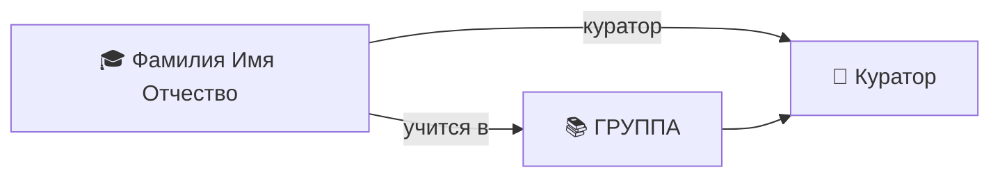

---
tags:
  - кпк/студент
группа:
куратор:
классный_руководитель:
дата_рождения:
пол:
телефон:
email:
снилс:
паспорт:
---

# 🎓 Фамилия Имя Отчество

<!-- Скопируйте этот файл в папку студента и переименуйте в «Фамилия Имя Отчество.md» -->

> [!warning] 🔒 Приватные данные
> СНИЛС, паспорт и контакты родителей — персональные данные. Заполняйте только то, что нужно для работы; не выносите в граф связей.

## 📋 Основное

> [!info]
> - **Группа:** 
> - **Куратор:** 
> - **Классный руководитель:** —
> - **Дата рождения:** —

## 👥 Контакты

> [!person] Контакты
> - 📱 **Личный:** —
> - 📧 **Email:** — <!-- почта/соцсети — если известно -->
> - 💬 **Соцсети:** —
> - 🔒 **Контакты родителей:** — <!-- ФИО родителя/опекуна + телефон, приватно -->

## 👨‍👩‍👦 Семья

> [!family]
> - Мама: —
> - Папа: —
> - Состав: — <!-- полная / неполная / многодетная / малообеспеченная -->
> - Особые отметки: — <!-- опека, только мать/отец и т.п. -->

## 🏥 Здоровье

> [!health] Здоровье
> - **Замечания:** — <!-- допуск к физкультуре и т.п. -->

## 📄 Документы

> [!doc] Документы
> - **СНИЛС:** — *(приватно)*
> - **Паспорт:** — *(приватно)*
> - **Копии документов:** — <!-- собраны / не собраны -->

## 🏅 Достижения и участие

| Дата | Мероприятие | Результат |
|------|-------------|-----------|
|  |  |  |

## 📊 Успеваемость

| Дата | Дисциплина | Оценка / отметка |
|------|------------|------------------|
|  |  |  |

## 📝 Журнал куратора

- <!-- беседы, посещаемость, оповещения родителей, даты -->

## 🔗 Связи

---

<!-- Если поле неизвестно — оставляйте «—», не удаляйте строку -->